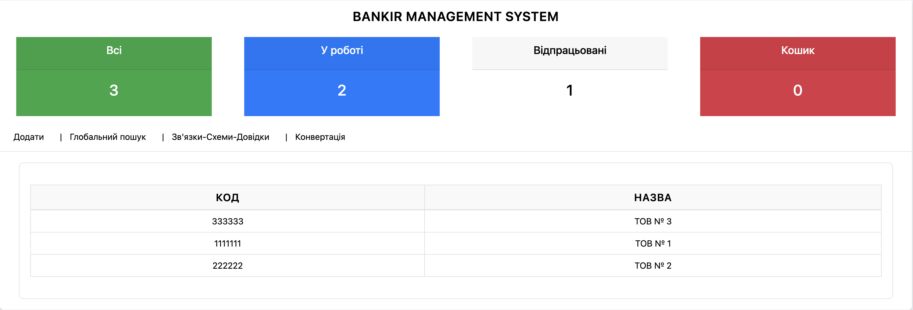

# Bankir v.2.0
[-blue?style=for-the-badge&logo=windows)](https://github.com/CAC-NAIAU/bankir/archive/refs/heads/main.zip)

## Опис
Цей проєкт реалізує: 
- процес управління інформацією про фінансово-господарську діяльність юридичних та фізичних осіб;
- автоматизацію процесів обробки та аналізу інформації про банківські транзакцій юридичних та фізичних осіб.

## Мета
Створення ІТ системи зберігання, обробки та аналізу даних про фінансово-господарську діяльності юридичних та фізичних осіб, а також пов’язаних з ними банківські рахунки та транзакції. 
Станом на сьогодні система дозволяє:
- зберігати інформацію про юридичних та фізичних осіб;
- на основі внесеної інформації про юридичних та фізичних осіб автоматизовано генерувати аналітичні схеми (і2 Analyst's Notebook) та довідки в форматі docx;
- здійснювати аналіз банківських транзакцій.

## Цільова аудиторія
- представники сектору сил безпеки та оборони;
- аналітики.

## Технології
* [Django 5.1.5](https://www.djangoproject.com/)
* [Python](https://www.python.org/)
* [Vue.js](https://vuejs.org/)
* [PostgreSQL](https://www.postgresql.org/)
* [CKEditor 5](https://ckeditor.com/)
* [Docker](https://www.docker.com/)
